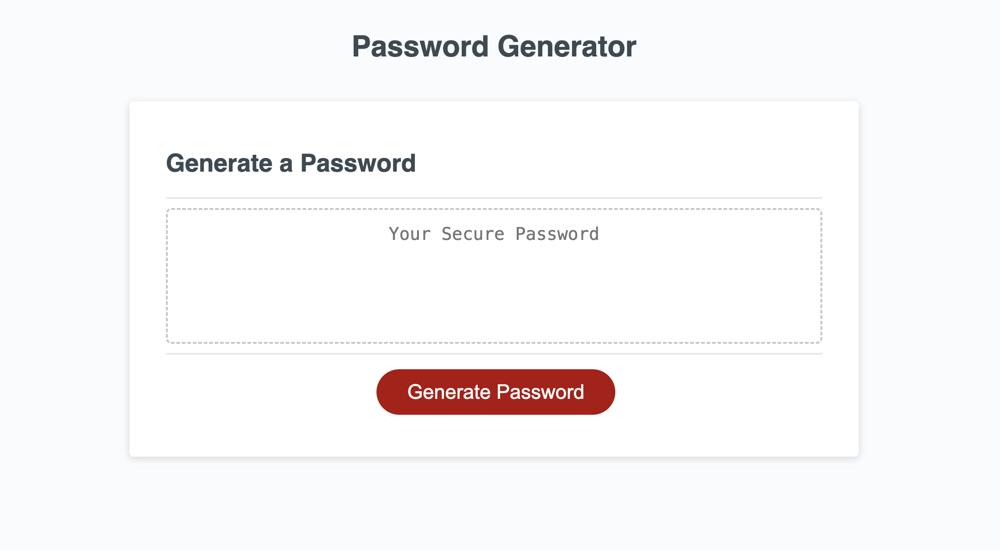

# Password Generator

## Simple JavaScript program to generate a random password

## Features

- Gives the user options to determine the length of the generated password
- Gives the user options to select the character types to include in the password like 'lowercase', 'uppercase', 'numbers' and 'special characters'
- User input is validated to make sure they entered and number and that the number is between 8 and 128 characters

## [View the website here](https://cguntur.github.io/password_generator/)

